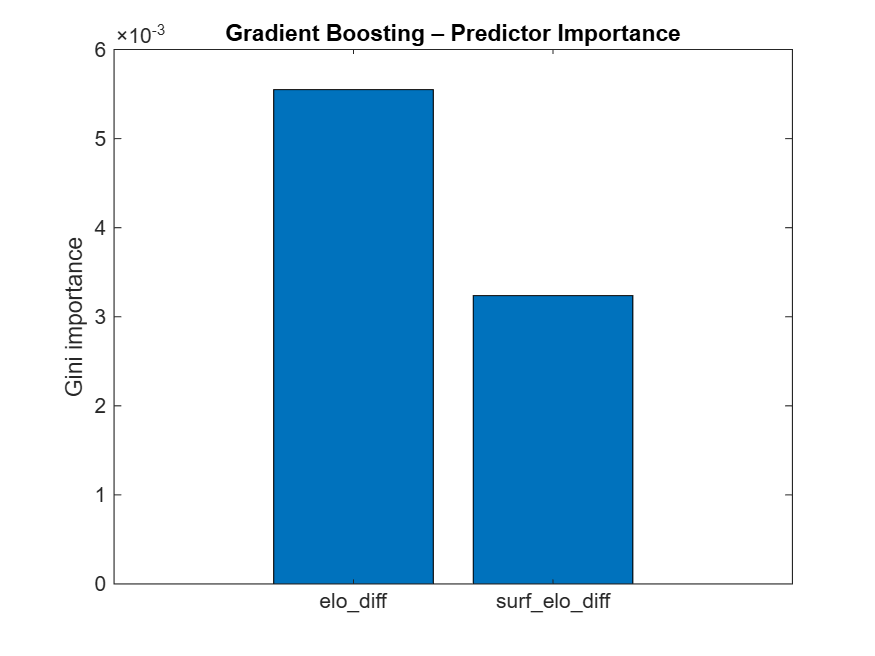
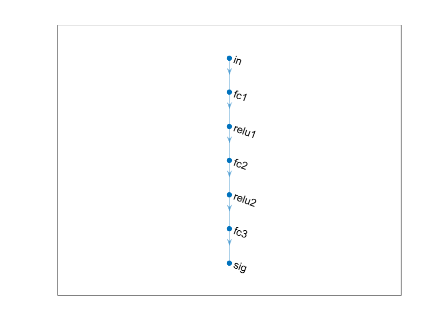

# Tennis 🎾

***Neural Net version***

<a name="beginToc"></a>

## Table of Contents
&emsp;&emsp;[Import data](#import-data)
 
&emsp;&emsp;[Some metrics](#some-metrics)
 
&emsp;&emsp;[Elo](#elo)
 
&emsp;&emsp;[Decision tree](#decision-tree)
 
&emsp;&emsp;[Random Forest](#random-forest)
 
&emsp;&emsp;[Gradient Boosting](#gradient-boosting)
 
&emsp;&emsp;[Neural Net](#neural-net)
 
&emsp;&emsp;[Utils](#utils)
 
<a name="endToc"></a>

## Import data
```matlab
% URL of the dataset
url = 'https://raw.githubusercontent.com/JeffSackmann/tennis_atp/refs/heads/master/atp_matches_2024.csv';

% Read the CSV file directly from the URL
opts = detectImportOptions(url);
opts = setvartype(opts,"tourney_date","string");
T = readtable(url, opts);

% Convert 'tourney_date' to datetime format
T.date = datetime(T.tourney_date, 'InputFormat', 'yyyyMMdd');

% Select only the relevant columns
cols = {'date', 'tourney_name', 'surface', ...
        'winner_name', 'loser_name', 'winner_rank', 'loser_rank'};
T = T(:, cols)
```
| |date|tourney_name|surface|winner_name|loser_name|winner_rank|loser_rank|
|:--:|:--:|:--:|:--:|:--:|:--:|:--:|:--:|
|1|01-Jan-2024|'Brisbane'|'Hard'|'Grigor Dimitrov'|'Holger Rune'|14|8|
|2|01-Jan-2024|'Brisbane'|'Hard'|'Holger Rune'|'Roman Safiullin'|8|39|
|3|01-Jan-2024|'Brisbane'|'Hard'|'Grigor Dimitrov'|'Jordan Thompson'|14|55|
|4|01-Jan-2024|'Brisbane'|'Hard'|'Holger Rune'|'James Duckworth'|8|116|
|5|01-Jan-2024|'Brisbane'|'Hard'|'Roman Safiullin'|'Matteo Arnaldi'|39|44|
|6|01-Jan-2024|'Brisbane'|'Hard'|'Jordan Thompson'|'Rafael Nadal'|55|672|
|7|01-Jan-2024|'Brisbane'|'Hard'|'Grigor Dimitrov'|'Rinky Hijikata'|14|71|
|8|01-Jan-2024|'Brisbane'|'Hard'|'Holger Rune'|'Alexander Shevchenko'|8|48|
|9|01-Jan-2024|'Brisbane'|'Hard'|'James Duckworth'|'Yannick Hanfmann'|116|51|
|10|01-Jan-2024|'Brisbane'|'Hard'|'Roman Safiullin'|'Alexei Popyrin'|39|40|
|11|01-Jan-2024|'Brisbane'|'Hard'|'Matteo Arnaldi'|'Lukas Klein'|44|170|
|12|01-Jan-2024|'Brisbane'|'Hard'|'Rafael Nadal'|'Jason Kubler'|672|102|
|13|01-Jan-2024|'Brisbane'|'Hard'|'Jordan Thompson'|'Ugo Humbert'|55|20|
|14|01-Jan-2024|'Brisbane'|'Hard'|'Rinky Hijikata'|'Tomas Machac'|71|78|

## Some metrics
```matlab
% Count the number of times each player appears as the winner
wins = groupcounts(T, 'winner_name')
```
| |winner_name|GroupCount|Percent|
|:--:|:--:|:--:|:--:|
|1|'Adam Walton'|3|0.0975|
|2|'Adria Soriano Barrera'|1|0.0325|
|3|'Adrian Mannarino'|16|0.5202|
|4|'Alan Fernando Rubio Fierros'|1|0.0325|
|5|'Albert Ramos'|3|0.0975|
|6|'Alejandro Davidovich Fokina'|19|0.6177|
|7|'Alejandro Moro Canas'|1|0.0325|
|8|'Alejandro Tabilo'|33|1.0728|
|9|'Aleksandar Kovacevic'|10|0.3251|
|10|'Aleksandar Vukic'|22|0.7152|
|11|'Aleksandre Bakshi'|2|0.0650|
|12|'Alex Bolt'|3|0.0975|
|13|'Alex De Minaur'|48|1.5605|
|14|'Alex Knaff'|3|0.0975|


[`pivot`](https://www.mathworks.com/help/matlab/ref/pivot.html) automatically counts the rows in each `(winner_name, surface)` group and spreads the result into a wide table—so the surfaces become columns and players remain rows—without any extra fill\-in work

```matlab
surface_stats = pivot(T, Rows="winner_name", Columns="surface", Method="count");
surface_stats = sortrows(surface_stats, "Clay", "descend")
```
| |winner_name|Clay|Grass|Hard|
|:--:|:--:|:--:|:--:|:--:|
|1|'Sebastian Baez'|26|0|5|
|2|'Casper Ruud'|25|1|26|
|3|'Alexander Zverev'|23|6|40|
|4|'Stefanos Tsitsipas'|22|2|21|
|5|'Francisco Cerundolo'|21|0|14|
|6|'Luciano Darderi'|21|2|2|
|7|'Felix Auger Aliassime'|18|0|15|
|8|'Tomas Martin Etcheverry'|18|1|12|
|9|'Carlos Alcaraz'|17|8|29|
|10|'Jan Lennard Struff'|16|6|9|
|11|'Novak Djokovic'|16|6|16|
|12|'Facundo Diaz Acosta'|15|0|1|
|13|'Mariano Navone'|15|0|3|
|14|'Matteo Berrettini'|15|6|11|

```matlab
% Define player names
players = {'Novak Djokovic', 'Carlos Alcaraz'};

% Apply the filter
djoko_vs_alcaraz = T( ...
    ismember(T.winner_name, players) & ...
    ismember(T.loser_name, players), :)
```
| |date|tourney_name|surface|winner_name|loser_name|winner_rank|loser_rank|
|:--:|:--:|:--:|:--:|:--:|:--:|:--:|:--:|
|1|01-Jul-2024|'Wimbledon'|'Grass'|'Carlos Alcaraz'|'Novak Djokovic'|3|2|
|2|29-Jul-2024|'Paris Olympics'|'Clay'|'Novak Djokovic'|'Carlos Alcaraz'|2|3|

-  `ismember(T.winner_name, players)` checks if the winner is one of the two players. 
-  `ismember(T.loser_name, players)` checks the same for the loser. 
-  The `&` combines the two conditions. 
-  The final `, :` selects all columns for the rows that match. 

## Elo
```matlab
dataset = buildDatasetElo(T)
```
| |elo_diff|surf_elo_diff|label|
|:--:|:--:|:--:|:--:|
|1|0|0|1|
|2|0|0|0|
|3|-16|-16|1|
|4|16|16|0|
|5|16|16|1|
|6|-16|-16|0|
|7|0.7363|0.7363|1|
|8|-0.7363|-0.7363|0|
|9|-16.7363|-16.7363|1|
|10|16.7363|16.7363|0|
|11|-15.2637|-15.2637|1|
|12|15.2637|15.2637|0|
|13|31.2637|31.2637|1|
|14|-31.2637|-31.2637|0|

## Decision tree
```matlab
%% --- 1.  Feature matrix and labels ------------------------------------
% dataset is the table returned by buildDatasetElo
X = dataset(:, {'elo_diff','surf_elo_diff'});   % two numeric predictors
y = categorical(dataset.label);                 % 0 / 1 → categorical

%% --- 2.  Train / test split (stratified 25 % hold-out) -----------------
cvp      = cvpartition(y, 'Holdout', 0.25);     % stratifies automatically
Xtrain   = X(cvp.training, :);
ytrain   = y(cvp.training);
Xtest    = X(cvp.test, :);
ytest    = y(cvp.test);

%% --- 3.  Fit a shallow decision tree ----------------------------------
% “max_depth = 4” in scikit-learn ≈ (2^4−1) = 15 terminal nodes max.
tree = fitctree(Xtrain, ytrain, ...
                'MaxNumSplits', 15, ...        % controls depth
                'SplitCriterion', 'gdi', ...
                'PredictorNames', {'elo_diff','surf_elo_diff'}, ...
                'ClassNames', categories(ytrain));

%% --- 4.  Predictions, accuracy, AUC -----------------------------------
[predsCell, scores] = predict(tree, Xtest);         % scores(:,2) = P(label==1)
preds   = categorical(predsCell, categories(ytest));

accuracy = mean(preds == ytest);

[~,~,~,auc] = perfcurve(double(ytest), scores(:,2), '1');

fprintf('Decision-Tree accuracy : %.3f\n', accuracy);
```

```matlabTextOutput
Decision-Tree accuracy : 0.573
```

```matlab
fprintf('Decision-Tree AUC      : %.3f\n', auc);
```

```matlabTextOutput
Decision-Tree AUC      : 0.376
```

```matlab

%% --- 5.  (Optional) quick visuals -------------------------------------
% Confusion matrix
confusionchart(ytest, preds, 'RowSummary','row-normalized')
```


```matlab

% Inspect the learned tree
view(tree, 'Mode', 'graph')
```


## Random Forest
```matlab
%% --- Random Forest (200 trees, depth ≤ 5) -----------------------------
rng(42)                                   % for reproducibility

maxDepth     = 5;
maxNumSplits = 2^maxDepth - 1;            % 31 → depth-5 tree

tTree  = templateTree('MaxNumSplits', maxNumSplits);

forest = fitcensemble( Xtrain, ytrain, ...
                       'Method',            'Bag', ...    % bagging = RF
                       'NumLearningCycles', 200, ...
                       'Learners',          tTree, ...
                       'ClassNames',        categories(ytrain) );

%% --- Predictions & metrics --------------------------------------------
[predsCell, scores] = predict(forest, Xtest);
preds = categorical(predsCell, categories(ytest));  % same type as ytest

accuracy = mean(preds == ytest);

[~,~,~,auc] = perfcurve(double(ytest), scores(:,2), 1);

fprintf('Random-Forest accuracy : %.3f\n', accuracy);
```

```matlabTextOutput
Random-Forest accuracy : 0.594
```

```matlab
fprintf('Random-Forest AUC      : %.3f\n', auc);
```

```matlabTextOutput
Random-Forest AUC      : 0.361
```

```matlab

%% Confusion matrix
confusionchart(ytest, preds, 'RowSummary','row-normalized');
```


```matlab
%% Feature importance (OOB permutation)
imp = oobPermutedPredictorImportance(forest); % function call

figure
bar(imp)
xticklabels({'elo_diff','surf_elo_diff'})
title('OOB Permutation Importance')
ylabel('Δ OOB error')
```


## Gradient Boosting
```matlab
%% --- Gradient Boosting (LogitBoost, depth-3 stumps) -------------------
rng(42)                                   % for reproducibility

maxDepth      = 3;                        % scikit default
maxNumSplits  = 2^maxDepth - 1;           % 7
nTrees        = 100;                      % scikit default (can tune)

tTree   = templateTree('MaxNumSplits', maxNumSplits);   % weak learner
gbm    = fitcensemble( Xtrain, ytrain, ...
                       'Method',            'LogitBoost', ...
                       'NumLearningCycles', nTrees, ...
                       'Learners',          tTree, ...
                       'ClassNames',        categories(ytrain), ...
                       'LearnRate',         0.1 );      % scikit default

%% --- Predictions & metrics --------------------------------------------
[predsCell, scores] = predict(gbm, Xtest);
preds   = categorical(predsCell, categories(ytest));

accuracy = mean(preds == ytest);

[~,~,~,auc] = perfcurve(double(ytest), scores(:,2), 1);

fprintf('Gradient-Boosting accuracy : %.3f\n', accuracy);
```

```matlabTextOutput
Gradient-Boosting accuracy : 0.590
```

```matlab
fprintf('Gradient-Boosting AUC      : %.3f\n', auc);
```

```matlabTextOutput
Gradient-Boosting AUC      : 0.360
```

```matlab

%% Confusion matrix
confusionchart(ytest, preds, 'RowSummary','row-normalized');
```


```matlab
%% (Optional) feature importance ----------------------------------------
imp = predictorImportance(gbm);   % Gini importance for boosted trees

figure
bar(imp)
xticklabels({'elo_diff','surf_elo_diff'})
title('Gradient Boosting – Predictor Importance')
ylabel('Gini importance')
```



## Neural Net

1.Prepare data (same split you already have)

```matlab
% Xtrain, Xtest, ytrain, ytest come from the earlier cvpartition code
% dlnetwork expects features×batch
XtrainMat = Xtrain{:,:}';    % or table2array(Xtrain)'
XtestMat  = Xtest{:,:}';

% Standardise features:  z = (x-μ)/σ  (store params for test set)
mu  = mean(XtrainMat, 2);
sig = std(XtrainMat, 0, 2);
XtrainMat = (XtrainMat - mu) ./ sig;
XtestMat  = (XtestMat  - mu) ./ sig;

% Convert labels to single precision column vectors
Ytrain = single(ytrain=='1');       % 1 for win, 0 for loss
Ytest  = single(ytest =='1');
```

2. Define the network (2\-16\-8\-1 + sigmoid)

```matlab
layers = [
    featureInputLayer(2,      'Name','in')            % 2 features
    fullyConnectedLayer(16,   'Name','fc1')
    reluLayer('Name','relu1')
    fullyConnectedLayer(8,    'Name','fc2')
    reluLayer('Name','relu2')
    fullyConnectedLayer(1,    'Name','fc3')
    sigmoidLayer('Name','sig')                        % probability
];

dlnet = dlnetwork(layers);         % initialise learnables :contentReference[oaicite:0]{index=0}
plot(dlnet)
```



3.  Set training options

```matlab
numEpochs      = 500;
miniBatchSize  = 64;
learnRate      = 1e-3;
trailingAvg    = [];
trailingAvgSq  = [];
executionEnv   = "auto";           % CPU/GPU automatically
```

4.  Custom training loop

```matlab
iteration = 0;
N = numel(Ytrain);

for epoch = 1:numEpochs
    % Shuffle every epoch
    idx = randperm(N);
    XtrainMat = XtrainMat(:, idx);
    Ytrain    = Ytrain(idx);

    for i = 1:miniBatchSize:N
        iteration = iteration + 1;
        % Mini-batch
        batchIdx   = i:min(i+miniBatchSize-1,N);
        XBatch = dlarray(XtrainMat(:, batchIdx), 'CB');   % [2 × B]
        TBatch = dlarray(Ytrain(batchIdx)',      'CB');

        if (executionEnv == "gpu")
            XBatch = gpuArray(XBatch);
            TBatch = gpuArray(TBatch);
        end

        % --- Forward + loss + gradients ---------------------------
        [loss, gradients] = dlfeval(@modelLoss, dlnet, XBatch, TBatch);

        % --- Adam update -----------------------------------------
        [dlnet,trailingAvg,trailingAvgSq] = adamupdate( ...
            dlnet, gradients, trailingAvg, trailingAvgSq, ...
            iteration, learnRate);

        % --- Monitor ---------------------------------------------
        if mod(iteration,50)==0
            fprintf("Iter %5d | loss = %.4f\n", iteration, gather(loss));
        end
    end
end
```

```matlabTextOutput
Iter    50 | loss = 0.6848
Iter   100 | loss = 0.6878
Iter   150 | loss = 0.6114
Iter   200 | loss = 0.6902
Iter   250 | loss = 0.6532
Iter   300 | loss = 0.6628
Iter   350 | loss = 0.6578
Iter   400 | loss = 0.6109
Iter   450 | loss = 0.6602
Iter   500 | loss = 0.6859
Iter   550 | loss = 0.6421
Iter   600 | loss = 0.6206
Iter   650 | loss = 0.6314
Iter   700 | loss = 0.6634
Iter   750 | loss = 0.6952
Iter   800 | loss = 0.7343
Iter   850 | loss = 0.6713
Iter   900 | loss = 0.7029
Iter   950 | loss = 0.6648
Iter  1000 | loss = 0.6979
Iter  1050 | loss = 0.6864
Iter  1100 | loss = 0.6227
Iter  1150 | loss = 0.6974
Iter  1200 | loss = 0.6440
Iter  1250 | loss = 0.6970
Iter  1300 | loss = 0.6127
Iter  1350 | loss = 0.6676
Iter  1400 | loss = 0.6407
Iter  1450 | loss = 0.6540
Iter  1500 | loss = 0.6535
Iter  1550 | loss = 0.6930
Iter  1600 | loss = 0.7074
Iter  1650 | loss = 0.6833
Iter  1700 | loss = 0.7306
Iter  1750 | loss = 0.6375
Iter  1800 | loss = 0.6615
Iter  1850 | loss = 0.6411
Iter  1900 | loss = 0.6340
Iter  1950 | loss = 0.6338
Iter  2000 | loss = 0.6557
Iter  2050 | loss = 0.6088
Iter  2100 | loss = 0.6348
Iter  2150 | loss = 0.6380
Iter  2200 | loss = 0.6332
Iter  2250 | loss = 0.6505
Iter  2300 | loss = 0.5834
Iter  2350 | loss = 0.6295
Iter  2400 | loss = 0.6637
Iter  2450 | loss = 0.7002
Iter  2500 | loss = 0.6758
Iter  2550 | loss = 0.6452
Iter  2600 | loss = 0.6267
Iter  2650 | loss = 0.6091
Iter  2700 | loss = 0.6214
Iter  2750 | loss = 0.5890
Iter  2800 | loss = 0.7006
Iter  2850 | loss = 0.6265
Iter  2900 | loss = 0.6590
Iter  2950 | loss = 0.6338
Iter  3000 | loss = 0.5625
Iter  3050 | loss = 0.6821
Iter  3100 | loss = 0.5911
Iter  3150 | loss = 0.6418
Iter  3200 | loss = 0.6895
Iter  3250 | loss = 0.6828
Iter  3300 | loss = 0.6851
Iter  3350 | loss = 0.6322
Iter  3400 | loss = 0.6360
Iter  3450 | loss = 0.6689
Iter  3500 | loss = 0.6232
Iter  3550 | loss = 0.5907
Iter  3600 | loss = 0.6429
Iter  3650 | loss = 0.7173
Iter  3700 | loss = 0.6027
Iter  3750 | loss = 0.6202
Iter  3800 | loss = 0.6471
Iter  3850 | loss = 0.6315
Iter  3900 | loss = 0.6297
Iter  3950 | loss = 0.5964
Iter  4000 | loss = 0.6249
Iter  4050 | loss = 0.6381
Iter  4100 | loss = 0.6460
Iter  4150 | loss = 0.6703
Iter  4200 | loss = 0.6951
Iter  4250 | loss = 0.6928
Iter  4300 | loss = 0.6224
Iter  4350 | loss = 0.6781
Iter  4400 | loss = 0.6229
Iter  4450 | loss = 0.6270
Iter  4500 | loss = 0.5828
Iter  4550 | loss = 0.6216
Iter  4600 | loss = 0.6376
Iter  4650 | loss = 0.6092
Iter  4700 | loss = 0.6474
Iter  4750 | loss = 0.6704
Iter  4800 | loss = 0.6597
Iter  4850 | loss = 0.6954
Iter  4900 | loss = 0.6442
Iter  4950 | loss = 0.6382
Iter  5000 | loss = 0.6639
Iter  5050 | loss = 0.6550
Iter  5100 | loss = 0.6643
Iter  5150 | loss = 0.6874
Iter  5200 | loss = 0.6379
Iter  5250 | loss = 0.6751
Iter  5300 | loss = 0.6790
Iter  5350 | loss = 0.6591
Iter  5400 | loss = 0.6650
Iter  5450 | loss = 0.5579
Iter  5500 | loss = 0.6577
Iter  5550 | loss = 0.6476
Iter  5600 | loss = 0.6715
Iter  5650 | loss = 0.6025
Iter  5700 | loss = 0.6376
Iter  5750 | loss = 0.6712
Iter  5800 | loss = 0.6524
Iter  5850 | loss = 0.6019
Iter  5900 | loss = 0.6066
Iter  5950 | loss = 0.6326
Iter  6000 | loss = 0.6264
Iter  6050 | loss = 0.6245
Iter  6100 | loss = 0.6278
Iter  6150 | loss = 0.6437
Iter  6200 | loss = 0.6744
Iter  6250 | loss = 0.6795
Iter  6300 | loss = 0.6915
Iter  6350 | loss = 0.6025
Iter  6400 | loss = 0.7040
Iter  6450 | loss = 0.6402
Iter  6500 | loss = 0.6934
Iter  6550 | loss = 0.6202
Iter  6600 | loss = 0.6886
Iter  6650 | loss = 0.6291
Iter  6700 | loss = 0.6431
Iter  6750 | loss = 0.6868
Iter  6800 | loss = 0.5944
Iter  6850 | loss = 0.6627
Iter  6900 | loss = 0.6773
Iter  6950 | loss = 0.6266
Iter  7000 | loss = 0.7180
Iter  7050 | loss = 0.6476
Iter  7100 | loss = 0.5932
Iter  7150 | loss = 0.6501
Iter  7200 | loss = 0.6571
Iter  7250 | loss = 0.6522
Iter  7300 | loss = 0.5251
Iter  7350 | loss = 0.6396
Iter  7400 | loss = 0.6261
Iter  7450 | loss = 0.6090
Iter  7500 | loss = 0.6234
Iter  7550 | loss = 0.6676
Iter  7600 | loss = 0.6026
Iter  7650 | loss = 0.5958
Iter  7700 | loss = 0.6373
Iter  7750 | loss = 0.6167
Iter  7800 | loss = 0.6201
Iter  7850 | loss = 0.6262
Iter  7900 | loss = 0.6370
Iter  7950 | loss = 0.5917
Iter  8000 | loss = 0.5822
Iter  8050 | loss = 0.5736
Iter  8100 | loss = 0.6638
Iter  8150 | loss = 0.6232
Iter  8200 | loss = 0.5955
Iter  8250 | loss = 0.6310
Iter  8300 | loss = 0.6530
Iter  8350 | loss = 0.6543
Iter  8400 | loss = 0.6047
Iter  8450 | loss = 0.6521
Iter  8500 | loss = 0.6732
Iter  8550 | loss = 0.6399
Iter  8600 | loss = 0.6347
Iter  8650 | loss = 0.6608
Iter  8700 | loss = 0.6262
Iter  8750 | loss = 0.6606
Iter  8800 | loss = 0.6501
Iter  8850 | loss = 0.5953
Iter  8900 | loss = 0.7085
Iter  8950 | loss = 0.6803
Iter  9000 | loss = 0.6848
Iter  9050 | loss = 0.6117
Iter  9100 | loss = 0.6539
Iter  9150 | loss = 0.6464
Iter  9200 | loss = 0.6647
Iter  9250 | loss = 0.5918
Iter  9300 | loss = 0.7204
Iter  9350 | loss = 0.6368
Iter  9400 | loss = 0.6882
Iter  9450 | loss = 0.6259
Iter  9500 | loss = 0.7348
Iter  9550 | loss = 0.6883
Iter  9600 | loss = 0.6636
Iter  9650 | loss = 0.7093
Iter  9700 | loss = 0.6683
Iter  9750 | loss = 0.6061
Iter  9800 | loss = 0.6581
Iter  9850 | loss = 0.6634
Iter  9900 | loss = 0.6143
Iter  9950 | loss = 0.6075
Iter 10000 | loss = 0.6453
Iter 10050 | loss = 0.6159
Iter 10100 | loss = 0.6235
Iter 10150 | loss = 0.6098
Iter 10200 | loss = 0.6604
Iter 10250 | loss = 0.6255
Iter 10300 | loss = 0.6420
Iter 10350 | loss = 0.6414
Iter 10400 | loss = 0.7164
Iter 10450 | loss = 0.6504
Iter 10500 | loss = 0.6653
Iter 10550 | loss = 0.6626
Iter 10600 | loss = 0.6094
Iter 10650 | loss = 0.7008
Iter 10700 | loss = 0.5701
Iter 10750 | loss = 0.6828
Iter 10800 | loss = 0.6073
Iter 10850 | loss = 0.6827
Iter 10900 | loss = 0.6676
Iter 10950 | loss = 0.7250
Iter 11000 | loss = 0.7122
Iter 11050 | loss = 0.6345
Iter 11100 | loss = 0.6373
Iter 11150 | loss = 0.6880
Iter 11200 | loss = 0.6878
Iter 11250 | loss = 0.7150
Iter 11300 | loss = 0.6522
Iter 11350 | loss = 0.6199
Iter 11400 | loss = 0.6652
Iter 11450 | loss = 0.5993
Iter 11500 | loss = 0.7064
Iter 11550 | loss = 0.6366
Iter 11600 | loss = 0.6651
Iter 11650 | loss = 0.6737
Iter 11700 | loss = 0.6498
Iter 11750 | loss = 0.6458
Iter 11800 | loss = 0.6163
Iter 11850 | loss = 0.5943
Iter 11900 | loss = 0.5843
Iter 11950 | loss = 0.6388
Iter 12000 | loss = 0.6165
Iter 12050 | loss = 0.6514
Iter 12100 | loss = 0.6681
Iter 12150 | loss = 0.6747
Iter 12200 | loss = 0.6792
Iter 12250 | loss = 0.6096
Iter 12300 | loss = 0.6640
Iter 12350 | loss = 0.6429
Iter 12400 | loss = 0.5963
Iter 12450 | loss = 0.6191
Iter 12500 | loss = 0.6533
Iter 12550 | loss = 0.6139
Iter 12600 | loss = 0.6742
Iter 12650 | loss = 0.6435
Iter 12700 | loss = 0.6524
Iter 12750 | loss = 0.6464
Iter 12800 | loss = 0.6330
Iter 12850 | loss = 0.6041
Iter 12900 | loss = 0.6584
Iter 12950 | loss = 0.6019
Iter 13000 | loss = 0.6312
Iter 13050 | loss = 0.6499
Iter 13100 | loss = 0.6550
Iter 13150 | loss = 0.6188
Iter 13200 | loss = 0.6315
Iter 13250 | loss = 0.6187
Iter 13300 | loss = 0.6751
Iter 13350 | loss = 0.7355
Iter 13400 | loss = 0.6571
Iter 13450 | loss = 0.6004
Iter 13500 | loss = 0.6244
Iter 13550 | loss = 0.5918
Iter 13600 | loss = 0.6569
Iter 13650 | loss = 0.6473
Iter 13700 | loss = 0.6079
Iter 13750 | loss = 0.6149
Iter 13800 | loss = 0.6736
Iter 13850 | loss = 0.6260
Iter 13900 | loss = 0.6703
Iter 13950 | loss = 0.6262
Iter 14000 | loss = 0.6121
Iter 14050 | loss = 0.5951
Iter 14100 | loss = 0.6179
Iter 14150 | loss = 0.5809
Iter 14200 | loss = 0.6399
Iter 14250 | loss = 0.6179
Iter 14300 | loss = 0.6415
Iter 14350 | loss = 0.6343
Iter 14400 | loss = 0.6513
Iter 14450 | loss = 0.6350
Iter 14500 | loss = 0.7435
Iter 14550 | loss = 0.6361
Iter 14600 | loss = 0.6428
Iter 14650 | loss = 0.6082
Iter 14700 | loss = 0.6691
Iter 14750 | loss = 0.5968
Iter 14800 | loss = 0.6289
Iter 14850 | loss = 0.6416
Iter 14900 | loss = 0.6392
Iter 14950 | loss = 0.6729
Iter 15000 | loss = 0.5902
Iter 15050 | loss = 0.6636
Iter 15100 | loss = 0.6080
Iter 15150 | loss = 0.5996
Iter 15200 | loss = 0.5992
Iter 15250 | loss = 0.6530
Iter 15300 | loss = 0.6574
Iter 15350 | loss = 0.7220
Iter 15400 | loss = 0.6555
Iter 15450 | loss = 0.6513
Iter 15500 | loss = 0.6169
Iter 15550 | loss = 0.5897
Iter 15600 | loss = 0.6378
Iter 15650 | loss = 0.5904
Iter 15700 | loss = 0.6723
Iter 15750 | loss = 0.7216
Iter 15800 | loss = 0.6246
Iter 15850 | loss = 0.6656
Iter 15900 | loss = 0.5919
Iter 15950 | loss = 0.6502
Iter 16000 | loss = 0.6216
Iter 16050 | loss = 0.6338
Iter 16100 | loss = 0.6518
Iter 16150 | loss = 0.6985
Iter 16200 | loss = 0.6503
Iter 16250 | loss = 0.6456
Iter 16300 | loss = 0.6836
Iter 16350 | loss = 0.6368
Iter 16400 | loss = 0.5779
Iter 16450 | loss = 0.7156
Iter 16500 | loss = 0.7071
Iter 16550 | loss = 0.6098
Iter 16600 | loss = 0.6256
Iter 16650 | loss = 0.6846
Iter 16700 | loss = 0.6466
Iter 16750 | loss = 0.6233
Iter 16800 | loss = 0.6061
Iter 16850 | loss = 0.6516
Iter 16900 | loss = 0.6158
Iter 16950 | loss = 0.6190
Iter 17000 | loss = 0.6816
Iter 17050 | loss = 0.6674
Iter 17100 | loss = 0.6315
Iter 17150 | loss = 0.6861
Iter 17200 | loss = 0.6875
Iter 17250 | loss = 0.6270
Iter 17300 | loss = 0.6907
Iter 17350 | loss = 0.6611
Iter 17400 | loss = 0.6105
Iter 17450 | loss = 0.6047
Iter 17500 | loss = 0.6285
Iter 17550 | loss = 0.6292
Iter 17600 | loss = 0.7120
Iter 17650 | loss = 0.6585
Iter 17700 | loss = 0.6879
Iter 17750 | loss = 0.6428
Iter 17800 | loss = 0.6557
Iter 17850 | loss = 0.6108
Iter 17900 | loss = 0.7129
Iter 17950 | loss = 0.6156
Iter 18000 | loss = 0.6322
Iter 18050 | loss = 0.6962
Iter 18100 | loss = 0.6444
Iter 18150 | loss = 0.6738
Iter 18200 | loss = 0.6307
Iter 18250 | loss = 0.7479
Iter 18300 | loss = 0.6463
Iter 18350 | loss = 0.6774
Iter 18400 | loss = 0.5841
Iter 18450 | loss = 0.6187
Iter 18500 | loss = 0.6426
Iter 18550 | loss = 0.6086
Iter 18600 | loss = 0.6610
Iter 18650 | loss = 0.5886
Iter 18700 | loss = 0.6643
Iter 18750 | loss = 0.6091
Iter 18800 | loss = 0.6027
Iter 18850 | loss = 0.6868
Iter 18900 | loss = 0.6330
Iter 18950 | loss = 0.6296
Iter 19000 | loss = 0.6561
Iter 19050 | loss = 0.6044
Iter 19100 | loss = 0.6196
Iter 19150 | loss = 0.6418
Iter 19200 | loss = 0.6721
Iter 19250 | loss = 0.6600
Iter 19300 | loss = 0.6098
Iter 19350 | loss = 0.5439
Iter 19400 | loss = 0.6643
Iter 19450 | loss = 0.6824
Iter 19500 | loss = 0.6432
Iter 19550 | loss = 0.6123
Iter 19600 | loss = 0.6500
Iter 19650 | loss = 0.6349
Iter 19700 | loss = 0.6557
Iter 19750 | loss = 0.6395
Iter 19800 | loss = 0.6895
Iter 19850 | loss = 0.6610
Iter 19900 | loss = 0.6410
Iter 19950 | loss = 0.6419
Iter 20000 | loss = 0.6741
Iter 20050 | loss = 0.6366
Iter 20100 | loss = 0.6424
Iter 20150 | loss = 0.6445
Iter 20200 | loss = 0.7021
Iter 20250 | loss = 0.6276
Iter 20300 | loss = 0.6800
Iter 20350 | loss = 0.6628
Iter 20400 | loss = 0.6496
Iter 20450 | loss = 0.6087
Iter 20500 | loss = 0.5708
Iter 20550 | loss = 0.6126
Iter 20600 | loss = 0.6112
Iter 20650 | loss = 0.5935
Iter 20700 | loss = 0.5717
Iter 20750 | loss = 0.6682
Iter 20800 | loss = 0.6425
Iter 20850 | loss = 0.6461
Iter 20900 | loss = 0.6401
Iter 20950 | loss = 0.6428
Iter 21000 | loss = 0.6292
Iter 21050 | loss = 0.6340
Iter 21100 | loss = 0.6891
Iter 21150 | loss = 0.6434
Iter 21200 | loss = 0.6135
Iter 21250 | loss = 0.6369
Iter 21300 | loss = 0.6689
Iter 21350 | loss = 0.6652
Iter 21400 | loss = 0.6541
Iter 21450 | loss = 0.6249
Iter 21500 | loss = 0.6080
Iter 21550 | loss = 0.6455
Iter 21600 | loss = 0.6451
Iter 21650 | loss = 0.6845
Iter 21700 | loss = 0.6393
Iter 21750 | loss = 0.6515
Iter 21800 | loss = 0.6388
Iter 21850 | loss = 0.7025
Iter 21900 | loss = 0.6684
Iter 21950 | loss = 0.6214
Iter 22000 | loss = 0.6418
Iter 22050 | loss = 0.6345
Iter 22100 | loss = 0.7004
Iter 22150 | loss = 0.6687
Iter 22200 | loss = 0.6985
Iter 22250 | loss = 0.6752
Iter 22300 | loss = 0.6243
Iter 22350 | loss = 0.7405
Iter 22400 | loss = 0.6641
Iter 22450 | loss = 0.6472
Iter 22500 | loss = 0.6493
Iter 22550 | loss = 0.5789
Iter 22600 | loss = 0.6683
Iter 22650 | loss = 0.6201
Iter 22700 | loss = 0.6057
Iter 22750 | loss = 0.7437
Iter 22800 | loss = 0.6350
Iter 22850 | loss = 0.6219
Iter 22900 | loss = 0.5949
Iter 22950 | loss = 0.6950
Iter 23000 | loss = 0.5889
Iter 23050 | loss = 0.6631
Iter 23100 | loss = 0.6429
Iter 23150 | loss = 0.6504
Iter 23200 | loss = 0.6541
Iter 23250 | loss = 0.6706
Iter 23300 | loss = 0.7028
Iter 23350 | loss = 0.6043
Iter 23400 | loss = 0.6414
Iter 23450 | loss = 0.6315
Iter 23500 | loss = 0.6284
Iter 23550 | loss = 0.6778
Iter 23600 | loss = 0.6071
Iter 23650 | loss = 0.6649
Iter 23700 | loss = 0.6101
Iter 23750 | loss = 0.6461
Iter 23800 | loss = 0.5681
Iter 23850 | loss = 0.6649
Iter 23900 | loss = 0.5751
Iter 23950 | loss = 0.6799
Iter 24000 | loss = 0.6494
Iter 24050 | loss = 0.7165
Iter 24100 | loss = 0.6968
Iter 24150 | loss = 0.6839
Iter 24200 | loss = 0.6277
Iter 24250 | loss = 0.7151
Iter 24300 | loss = 0.5990
Iter 24350 | loss = 0.6705
Iter 24400 | loss = 0.6415
Iter 24450 | loss = 0.6568
Iter 24500 | loss = 0.7058
Iter 24550 | loss = 0.6488
Iter 24600 | loss = 0.6064
Iter 24650 | loss = 0.6098
Iter 24700 | loss = 0.5640
Iter 24750 | loss = 0.5869
Iter 24800 | loss = 0.6431
Iter 24850 | loss = 0.6180
Iter 24900 | loss = 0.6753
Iter 24950 | loss = 0.6714
Iter 25000 | loss = 0.5861
Iter 25050 | loss = 0.6277
Iter 25100 | loss = 0.6942
Iter 25150 | loss = 0.6477
Iter 25200 | loss = 0.6638
Iter 25250 | loss = 0.6592
Iter 25300 | loss = 0.6672
Iter 25350 | loss = 0.6347
Iter 25400 | loss = 0.6467
Iter 25450 | loss = 0.6766
Iter 25500 | loss = 0.6397
Iter 25550 | loss = 0.6007
Iter 25600 | loss = 0.6914
Iter 25650 | loss = 0.7317
Iter 25700 | loss = 0.6288
Iter 25750 | loss = 0.7003
Iter 25800 | loss = 0.6643
Iter 25850 | loss = 0.6545
Iter 25900 | loss = 0.5893
Iter 25950 | loss = 0.6734
Iter 26000 | loss = 0.5983
Iter 26050 | loss = 0.6607
Iter 26100 | loss = 0.5927
Iter 26150 | loss = 0.6434
Iter 26200 | loss = 0.6525
Iter 26250 | loss = 0.6808
Iter 26300 | loss = 0.6184
Iter 26350 | loss = 0.6238
Iter 26400 | loss = 0.6925
Iter 26450 | loss = 0.6346
Iter 26500 | loss = 0.6660
Iter 26550 | loss = 0.6522
Iter 26600 | loss = 0.6435
Iter 26650 | loss = 0.6478
Iter 26700 | loss = 0.5839
Iter 26750 | loss = 0.6357
Iter 26800 | loss = 0.6572
Iter 26850 | loss = 0.6008
Iter 26900 | loss = 0.5928
Iter 26950 | loss = 0.6325
Iter 27000 | loss = 0.6122
Iter 27050 | loss = 0.6362
Iter 27100 | loss = 0.5754
Iter 27150 | loss = 0.6581
Iter 27200 | loss = 0.6126
Iter 27250 | loss = 0.6433
Iter 27300 | loss = 0.6219
Iter 27350 | loss = 0.5986
Iter 27400 | loss = 0.5639
Iter 27450 | loss = 0.6186
Iter 27500 | loss = 0.5992
Iter 27550 | loss = 0.6317
Iter 27600 | loss = 0.6380
Iter 27650 | loss = 0.5994
Iter 27700 | loss = 0.7335
Iter 27750 | loss = 0.5798
Iter 27800 | loss = 0.6961
Iter 27850 | loss = 0.6326
Iter 27900 | loss = 0.6542
Iter 27950 | loss = 0.6624
Iter 28000 | loss = 0.6472
Iter 28050 | loss = 0.6794
Iter 28100 | loss = 0.6480
Iter 28150 | loss = 0.6253
Iter 28200 | loss = 0.6222
Iter 28250 | loss = 0.6342
Iter 28300 | loss = 0.6092
Iter 28350 | loss = 0.6087
Iter 28400 | loss = 0.6783
Iter 28450 | loss = 0.7088
Iter 28500 | loss = 0.6111
Iter 28550 | loss = 0.6737
Iter 28600 | loss = 0.6850
Iter 28650 | loss = 0.6723
Iter 28700 | loss = 0.6416
Iter 28750 | loss = 0.6533
Iter 28800 | loss = 0.6860
Iter 28850 | loss = 0.6629
Iter 28900 | loss = 0.6154
Iter 28950 | loss = 0.6050
Iter 29000 | loss = 0.6224
Iter 29050 | loss = 0.6675
Iter 29100 | loss = 0.6992
Iter 29150 | loss = 0.6520
Iter 29200 | loss = 0.6368
Iter 29250 | loss = 0.7169
Iter 29300 | loss = 0.5791
Iter 29350 | loss = 0.6519
Iter 29400 | loss = 0.6616
Iter 29450 | loss = 0.6626
Iter 29500 | loss = 0.6081
Iter 29550 | loss = 0.6448
Iter 29600 | loss = 0.7033
Iter 29650 | loss = 0.6467
Iter 29700 | loss = 0.6596
Iter 29750 | loss = 0.6865
Iter 29800 | loss = 0.6323
Iter 29850 | loss = 0.5839
Iter 29900 | loss = 0.6405
Iter 29950 | loss = 0.6330
Iter 30000 | loss = 0.6559
Iter 30050 | loss = 0.6750
Iter 30100 | loss = 0.6142
Iter 30150 | loss = 0.7438
Iter 30200 | loss = 0.6804
Iter 30250 | loss = 0.6016
Iter 30300 | loss = 0.6326
Iter 30350 | loss = 0.6402
Iter 30400 | loss = 0.6186
Iter 30450 | loss = 0.6020
Iter 30500 | loss = 0.6589
Iter 30550 | loss = 0.6351
Iter 30600 | loss = 0.6370
Iter 30650 | loss = 0.6273
Iter 30700 | loss = 0.7236
Iter 30750 | loss = 0.6436
Iter 30800 | loss = 0.6080
Iter 30850 | loss = 0.6737
Iter 30900 | loss = 0.5820
Iter 30950 | loss = 0.6178
Iter 31000 | loss = 0.6485
Iter 31050 | loss = 0.6920
Iter 31100 | loss = 0.6159
Iter 31150 | loss = 0.6073
Iter 31200 | loss = 0.6487
Iter 31250 | loss = 0.6475
Iter 31300 | loss = 0.6457
Iter 31350 | loss = 0.6924
Iter 31400 | loss = 0.6980
Iter 31450 | loss = 0.6837
Iter 31500 | loss = 0.6635
Iter 31550 | loss = 0.6625
Iter 31600 | loss = 0.6563
Iter 31650 | loss = 0.6547
Iter 31700 | loss = 0.6343
Iter 31750 | loss = 0.5886
Iter 31800 | loss = 0.6309
Iter 31850 | loss = 0.6325
Iter 31900 | loss = 0.6835
Iter 31950 | loss = 0.6756
Iter 32000 | loss = 0.6319
Iter 32050 | loss = 0.6970
Iter 32100 | loss = 0.6071
Iter 32150 | loss = 0.6375
Iter 32200 | loss = 0.5652
Iter 32250 | loss = 0.6287
Iter 32300 | loss = 0.6314
Iter 32350 | loss = 0.6082
Iter 32400 | loss = 0.5575
Iter 32450 | loss = 0.6674
Iter 32500 | loss = 0.6229
Iter 32550 | loss = 0.6075
Iter 32600 | loss = 0.6995
Iter 32650 | loss = 0.6611
Iter 32700 | loss = 0.5929
Iter 32750 | loss = 0.6817
Iter 32800 | loss = 0.6083
Iter 32850 | loss = 0.4339
Iter 32900 | loss = 0.6366
Iter 32950 | loss = 0.6481
Iter 33000 | loss = 0.6934
Iter 33050 | loss = 0.6357
Iter 33100 | loss = 0.6407
Iter 33150 | loss = 0.6452
Iter 33200 | loss = 0.6615
Iter 33250 | loss = 0.6466
Iter 33300 | loss = 0.6164
Iter 33350 | loss = 0.6621
Iter 33400 | loss = 0.5906
Iter 33450 | loss = 0.6957
Iter 33500 | loss = 0.6585
Iter 33550 | loss = 0.6374
Iter 33600 | loss = 0.6842
Iter 33650 | loss = 0.6230
Iter 33700 | loss = 0.5970
Iter 33750 | loss = 0.6643
Iter 33800 | loss = 0.6501
Iter 33850 | loss = 0.6254
Iter 33900 | loss = 0.6758
Iter 33950 | loss = 0.6932
Iter 34000 | loss = 0.5982
Iter 34050 | loss = 0.6472
Iter 34100 | loss = 0.6238
Iter 34150 | loss = 0.6260
Iter 34200 | loss = 0.6373
Iter 34250 | loss = 0.6185
Iter 34300 | loss = 0.6434
Iter 34350 | loss = 0.6092
Iter 34400 | loss = 0.6290
Iter 34450 | loss = 0.6332
Iter 34500 | loss = 0.6471
Iter 34550 | loss = 0.6922
Iter 34600 | loss = 0.6082
Iter 34650 | loss = 0.6655
Iter 34700 | loss = 0.5783
Iter 34750 | loss = 0.6382
Iter 34800 | loss = 0.6619
Iter 34850 | loss = 0.6967
Iter 34900 | loss = 0.6360
Iter 34950 | loss = 0.5985
Iter 35000 | loss = 0.6582
Iter 35050 | loss = 0.6855
Iter 35100 | loss = 0.6542
Iter 35150 | loss = 0.6202
Iter 35200 | loss = 0.6688
Iter 35250 | loss = 0.6492
Iter 35300 | loss = 0.7186
Iter 35350 | loss = 0.6258
Iter 35400 | loss = 0.7063
Iter 35450 | loss = 0.6954
Iter 35500 | loss = 0.6406
Iter 35550 | loss = 0.6226
Iter 35600 | loss = 0.6482
Iter 35650 | loss = 0.6822
Iter 35700 | loss = 0.5997
Iter 35750 | loss = 0.6892
Iter 35800 | loss = 0.6358
Iter 35850 | loss = 0.6398
Iter 35900 | loss = 0.6663
Iter 35950 | loss = 0.6834
Iter 36000 | loss = 0.6456
Iter 36050 | loss = 0.6496
Iter 36100 | loss = 0.6691
Iter 36150 | loss = 0.6369
Iter 36200 | loss = 0.6258
Iter 36250 | loss = 0.6314
Iter 36300 | loss = 0.6214
Iter 36350 | loss = 0.6533
Iter 36400 | loss = 0.6202
Iter 36450 | loss = 0.6307
Iter 36500 | loss = 0.5358
```

```matlab
% ----- loss function ---------------------------------------------
function [loss, gradients] = modelLoss(net, X, T)
    Y    = forward(net, X);                           % 1 × B probabilities
    loss = crossentropy(Y, T, 'TargetCategories','independent');
    gradients = dlgradient(loss, net.Learnables);
end
```

The loop follows the pattern in MATLAB [*Custom Training Loops*](https://www.mathworks.com/help/deeplearning/custom-training-loops.html)


5.  Evaluate on the hold\-out set

```matlab
dlXTest = dlarray(XtestMat,'CB');
if (executionEnv == "gpu"), dlXTest = gpuArray(dlXTest); end

probTest = predict(dlnet, dlXTest);      % probabilities
predTest = gather(probTest > 0.5);       % class prediction

accuracy = mean(predTest == Ytest);
% --- get scores as a numeric column -----------------------------------
probTest = extractdata(probTest);   % dlarray → MATLAB double
probTest = probTest(:);             % ensure column (N × 1)

% --- get labels as logical or 0/1 double ------------------------------
% ytest is the original categorical (‘0’ / ‘1’) from the split
labels = (ytest == '1');            % logical column (N × 1)

% --- ROC / AUC ---------------------------------------------------------
[~,~,~,auc] = perfcurve(labels, probTest, true);   % positive class = true

fprintf('Neural-Net AUC : %.3f\n', auc);
```

```matlabTextOutput
Neural-Net AUC : 0.627
```

## Utils
```matlab
function [dataset, eloMap, surfEloMap] = buildDatasetElo(T)
%BUILD DATASET WITH GLOBAL- AND SURFACE-ELO DIFFERENCES
%   T – table with at least the columns:
%        'tourney_date' (numeric or datetime), 'winner_name', 'loser_name', 'surface'
%
%   dataset     – table of two features + binary label (one row per player-perspective)
%   eloMap      – containers.Map keyed by player name → final global Elo
%   surfEloMap  – containers.Map keyed by "player_surface" → final surface-specific Elo

% sort chronologically (MATLAB datetime or yyyymmdd numeric both work)
T   = sortrows(T, 'date');

K           = 32;            % Elo K-factor
baseRating  = 1500.0;        % default starting Elo
eloMap      = containers.Map('KeyType', 'char', 'ValueType', 'double');
surfEloMap  = containers.Map('KeyType', 'char', 'ValueType', 'double');

% we’ll grow a cell array then convert to table (simplest/clear)
rows = {};  
for i = 1:height(T)
    w       = T.winner_name{i};
    l       = T.loser_name{i};
    surface = T.surface{i};

    % ----- fetch (or lazily create) ratings -----
    if ~isKey(eloMap, w), eloMap(w) = baseRating; end
    if ~isKey(eloMap, l), eloMap(l) = baseRating; end
    keyWS = [w '_' surface];
    keyLS = [l '_' surface];
    if ~isKey(surfEloMap, keyWS), surfEloMap(keyWS) = baseRating; end
    if ~isKey(surfEloMap, keyLS), surfEloMap(keyLS) = baseRating; end

    eloW   = eloMap(w);
    eloL   = eloMap(l);
    surfW  = surfEloMap(keyWS);
    surfL  = surfEloMap(keyLS);

    % ----- add two perspectives -----
    rows(end+1,1:3) = {eloW - eloL,  surfW - surfL, 1}; %#ok<AGROW>
    rows(end+1,1:3) = {eloL - eloW,  surfL - surfW, 0}; %#ok<AGROW>

    % ----- update global Elo -----
    expW  = 1 / (1 + 10^((eloL - eloW)/400));
    eloMap(w) = eloW + K * (1 - expW);
    eloMap(l) = eloL + K * (0 - (1 - expW));

    % ----- update surface-specific Elo -----
    expWS = 1 / (1 + 10^((surfL - surfW)/400));
    surfEloMap(keyWS) = surfW + K * (1 - expWS);
    surfEloMap(keyLS) = surfL + K * (0 - (1 - expWS));
end

dataset = cell2table(rows, 'VariableNames', {'elo_diff','surf_elo_diff','label'});
end
```

```matlab
export tennis.mlx tennis.md;
```
