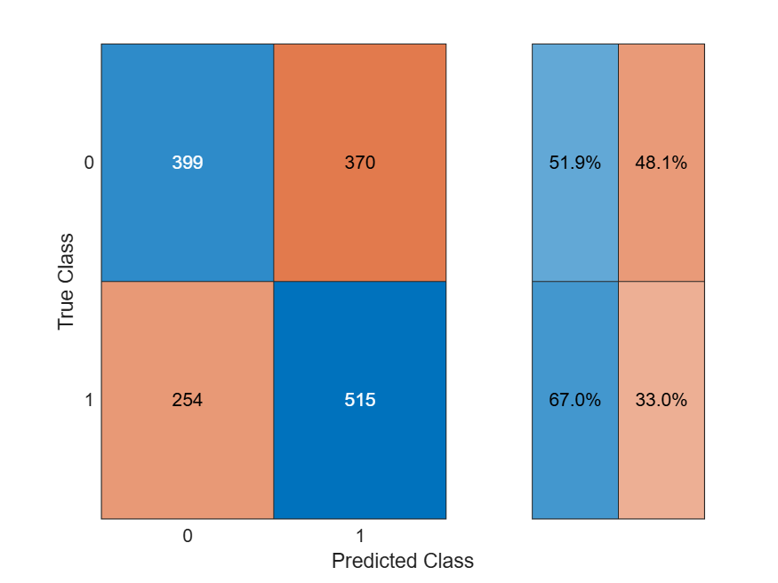

# tennis

Predict Roland Garros winner 🎾

<a name="beginToc"></a>

## Table of Contents
&emsp;&emsp;[Import data](#import-data)
 
&emsp;&emsp;[Some metrics](#some-metrics)
 
&emsp;&emsp;[Elo](#elo)
 
&emsp;&emsp;[Decision tree](#decision-tree)
 
&emsp;&emsp;[Random Forest](#random-forest)
 
&emsp;&emsp;[Gradient Boosting](#gradient-boosting)
 
&emsp;&emsp;[Utils](#utils)
 
<a name="endToc"></a>

## Import data
```matlab
% URL of the dataset
url = 'https://raw.githubusercontent.com/JeffSackmann/tennis_atp/refs/heads/master/atp_matches_2024.csv';

% Read the CSV file directly from the URL
opts = detectImportOptions(url);
opts = setvartype(opts,"tourney_date","string");
T = readtable(url, opts);

% Convert 'tourney_date' to datetime format
T.date = datetime(T.tourney_date, 'InputFormat', 'yyyyMMdd');

% Select only the relevant columns
cols = {'date', 'tourney_name', 'surface', ...
        'winner_name', 'loser_name', 'winner_rank', 'loser_rank'};
T = T(:, cols)
```
| |date|tourney_name|surface|winner_name|loser_name|winner_rank|loser_rank|
|:--:|:--:|:--:|:--:|:--:|:--:|:--:|:--:|
|1|01-Jan-2024|'Brisbane'|'Hard'|'Grigor Dimitrov'|'Holger Rune'|14|8|
|2|01-Jan-2024|'Brisbane'|'Hard'|'Holger Rune'|'Roman Safiullin'|8|39|
|3|01-Jan-2024|'Brisbane'|'Hard'|'Grigor Dimitrov'|'Jordan Thompson'|14|55|
|4|01-Jan-2024|'Brisbane'|'Hard'|'Holger Rune'|'James Duckworth'|8|116|
|5|01-Jan-2024|'Brisbane'|'Hard'|'Roman Safiullin'|'Matteo Arnaldi'|39|44|
|6|01-Jan-2024|'Brisbane'|'Hard'|'Jordan Thompson'|'Rafael Nadal'|55|672|
|7|01-Jan-2024|'Brisbane'|'Hard'|'Grigor Dimitrov'|'Rinky Hijikata'|14|71|
|8|01-Jan-2024|'Brisbane'|'Hard'|'Holger Rune'|'Alexander Shevchenko'|8|48|
|9|01-Jan-2024|'Brisbane'|'Hard'|'James Duckworth'|'Yannick Hanfmann'|116|51|
|10|01-Jan-2024|'Brisbane'|'Hard'|'Roman Safiullin'|'Alexei Popyrin'|39|40|
|11|01-Jan-2024|'Brisbane'|'Hard'|'Matteo Arnaldi'|'Lukas Klein'|44|170|
|12|01-Jan-2024|'Brisbane'|'Hard'|'Rafael Nadal'|'Jason Kubler'|672|102|
|13|01-Jan-2024|'Brisbane'|'Hard'|'Jordan Thompson'|'Ugo Humbert'|55|20|
|14|01-Jan-2024|'Brisbane'|'Hard'|'Rinky Hijikata'|'Tomas Machac'|71|78|

## Some metrics
```matlab
% Count the number of times each player appears as the winner
wins = groupcounts(T, 'winner_name')
```
| |winner_name|GroupCount|Percent|
|:--:|:--:|:--:|:--:|
|1|'Adam Walton'|3|0.0975|
|2|'Adria Soriano Barrera'|1|0.0325|
|3|'Adrian Mannarino'|16|0.5202|
|4|'Alan Fernando Rubio Fierros'|1|0.0325|
|5|'Albert Ramos'|3|0.0975|
|6|'Alejandro Davidovich Fokina'|19|0.6177|
|7|'Alejandro Moro Canas'|1|0.0325|
|8|'Alejandro Tabilo'|33|1.0728|
|9|'Aleksandar Kovacevic'|10|0.3251|
|10|'Aleksandar Vukic'|22|0.7152|
|11|'Aleksandre Bakshi'|2|0.0650|
|12|'Alex Bolt'|3|0.0975|
|13|'Alex De Minaur'|48|1.5605|
|14|'Alex Knaff'|3|0.0975|


[`pivot`](https://www.mathworks.com/help/matlab/ref/pivot.html) automatically counts the rows in each `(winner_name, surface)` group and spreads the result into a wide table—so the surfaces become columns and players remain rows—without any extra fill\-in work

```matlab
surface_stats = pivot(T, Rows="winner_name", Columns="surface", Method="count");
surface_stats = sortrows(surface_stats, "Clay", "descend")
```
| |winner_name|Clay|Grass|Hard|
|:--:|:--:|:--:|:--:|:--:|
|1|'Sebastian Baez'|26|0|5|
|2|'Casper Ruud'|25|1|26|
|3|'Alexander Zverev'|23|6|40|
|4|'Stefanos Tsitsipas'|22|2|21|
|5|'Francisco Cerundolo'|21|0|14|
|6|'Luciano Darderi'|21|2|2|
|7|'Felix Auger Aliassime'|18|0|15|
|8|'Tomas Martin Etcheverry'|18|1|12|
|9|'Carlos Alcaraz'|17|8|29|
|10|'Jan Lennard Struff'|16|6|9|
|11|'Novak Djokovic'|16|6|16|
|12|'Facundo Diaz Acosta'|15|0|1|
|13|'Mariano Navone'|15|0|3|
|14|'Matteo Berrettini'|15|6|11|

```matlab
% Define player names
players = {'Novak Djokovic', 'Carlos Alcaraz'};

% Apply the filter
djoko_vs_alcaraz = T( ...
    ismember(T.winner_name, players) & ...
    ismember(T.loser_name, players), :)
```
| |date|tourney_name|surface|winner_name|loser_name|winner_rank|loser_rank|
|:--:|:--:|:--:|:--:|:--:|:--:|:--:|:--:|
|1|01-Jul-2024|'Wimbledon'|'Grass'|'Carlos Alcaraz'|'Novak Djokovic'|3|2|
|2|29-Jul-2024|'Paris Olympics'|'Clay'|'Novak Djokovic'|'Carlos Alcaraz'|2|3|

-  `ismember(T.winner_name, players)` checks if the winner is one of the two players. 
-  `ismember(T.loser_name, players)` checks the same for the loser. 
-  The `&` combines the two conditions. 
-  The final `, :` selects all columns for the rows that match. 

## Elo
```matlab
dataset = buildDatasetElo(T)
```
| |elo_diff|surf_elo_diff|label|
|:--:|:--:|:--:|:--:|
|1|0|0|1|
|2|0|0|0|
|3|-16|-16|1|
|4|16|16|0|
|5|16|16|1|
|6|-16|-16|0|
|7|0.7363|0.7363|1|
|8|-0.7363|-0.7363|0|
|9|-16.7363|-16.7363|1|
|10|16.7363|16.7363|0|
|11|-15.2637|-15.2637|1|
|12|15.2637|15.2637|0|
|13|31.2637|31.2637|1|
|14|-31.2637|-31.2637|0|

## Decision tree
```matlab
%% --- 1.  Feature matrix and labels ------------------------------------
% dataset is the table returned by buildDatasetElo
X = dataset(:, {'elo_diff','surf_elo_diff'});   % two numeric predictors
y = categorical(dataset.label);                 % 0 / 1 → categorical

%% --- 2.  Train / test split (stratified 25 % hold-out) -----------------
cvp      = cvpartition(y, 'Holdout', 0.25);     % stratifies automatically
Xtrain   = X(cvp.training, :);
ytrain   = y(cvp.training);
Xtest    = X(cvp.test, :);
ytest    = y(cvp.test);

%% --- 3.  Fit a shallow decision tree ----------------------------------
% “max_depth = 4” in scikit-learn ≈ (2^4−1) = 15 terminal nodes max.
tree = fitctree(Xtrain, ytrain, ...
                'MaxNumSplits', 15, ...        % controls depth
                'SplitCriterion', 'gdi', ...
                'PredictorNames', {'elo_diff','surf_elo_diff'}, ...
                'ClassNames', categories(ytrain));

%% --- 4.  Predictions, accuracy, AUC -----------------------------------
[predsCell, scores] = predict(tree, Xtest);         % scores(:,2) = P(label==1)
preds   = categorical(predsCell, categories(ytest));

accuracy = mean(preds == ytest);

[~,~,~,auc] = perfcurve(double(ytest), scores(:,2), '1');

fprintf('Decision-Tree accuracy : %.3f\n', accuracy);
```

```matlabTextOutput
Decision-Tree accuracy : 0.573
```

```matlab
fprintf('Decision-Tree AUC      : %.3f\n', auc);
```

```matlabTextOutput
Decision-Tree AUC      : 0.376
```

```matlab

%% --- 5.  (Optional) quick visuals -------------------------------------
% Confusion matrix
confusionchart(ytest, preds, 'RowSummary','row-normalized')
```


```matlab

% Inspect the learned tree
view(tree, 'Mode', 'graph')
```


## Random Forest
```matlab
%% --- Random Forest (200 trees, depth ≤ 5) -----------------------------
rng(42)                                   % for reproducibility

maxDepth     = 5;
maxNumSplits = 2^maxDepth - 1;            % 31 → depth-5 tree

tTree  = templateTree('MaxNumSplits', maxNumSplits);

forest = fitcensemble( Xtrain, ytrain, ...
                       'Method',            'Bag', ...    % bagging = RF
                       'NumLearningCycles', 200, ...
                       'Learners',          tTree, ...
                       'ClassNames',        categories(ytrain) );

%% --- Predictions & metrics --------------------------------------------
[predsCell, scores] = predict(forest, Xtest);
preds = categorical(predsCell, categories(ytest));  % same type as ytest

accuracy = mean(preds == ytest);

[~,~,~,auc] = perfcurve(double(ytest), scores(:,2), 1);

fprintf('Random-Forest accuracy : %.3f\n', accuracy);
```

```matlabTextOutput
Random-Forest accuracy : 0.594
```

```matlab
fprintf('Random-Forest AUC      : %.3f\n', auc);
```

```matlabTextOutput
Random-Forest AUC      : 0.361
```

```matlab

%% Confusion matrix
confusionchart(ytest, preds, 'RowSummary','row-normalized');
```

```matlab
%% Feature importance (OOB permutation)
imp = oobPermutedPredictorImportance(forest); % function call

figure
bar(imp)
xticklabels({'elo_diff','surf_elo_diff'})
title('OOB Permutation Importance')
ylabel('Δ OOB error')
```



## Gradient Boosting
```matlab
%% --- Gradient Boosting (LogitBoost, depth-3 stumps) -------------------
rng(42)                                   % for reproducibility

maxDepth      = 3;                        % scikit default
maxNumSplits  = 2^maxDepth - 1;           % 7
nTrees        = 100;                      % scikit default (can tune)

tTree   = templateTree('MaxNumSplits', maxNumSplits);   % weak learner
gbm    = fitcensemble( Xtrain, ytrain, ...
                       'Method',            'LogitBoost', ...
                       'NumLearningCycles', nTrees, ...
                       'Learners',          tTree, ...
                       'ClassNames',        categories(ytrain), ...
                       'LearnRate',         0.1 );      % scikit default

%% --- Predictions & metrics --------------------------------------------
[predsCell, scores] = predict(gbm, Xtest);
preds   = categorical(predsCell, categories(ytest));

accuracy = mean(preds == ytest);

[~,~,~,auc] = perfcurve(double(ytest), scores(:,2), 1);

fprintf('Gradient-Boosting accuracy : %.3f\n', accuracy);
```

```matlabTextOutput
Gradient-Boosting accuracy : 0.590
```

```matlab
fprintf('Gradient-Boosting AUC      : %.3f\n', auc);
```

```matlabTextOutput
Gradient-Boosting AUC      : 0.360
```

```matlab

%% Confusion matrix
confusionchart(ytest, preds, 'RowSummary','row-normalized');
```


```matlab
%% (Optional) feature importance ----------------------------------------
imp = predictorImportance(gbm);   % Gini importance for boosted trees

figure
bar(imp)
xticklabels({'elo_diff','surf_elo_diff'})
title('Gradient Boosting – Predictor Importance')
ylabel('Gini importance')
```


## Utils
```matlab
function [dataset, eloMap, surfEloMap] = buildDatasetElo(T)
%BUILD DATASET WITH GLOBAL- AND SURFACE-ELO DIFFERENCES
%   T – table with at least the columns:
%        'tourney_date' (numeric or datetime), 'winner_name', 'loser_name', 'surface'
%
%   dataset     – table of two features + binary label (one row per player-perspective)
%   eloMap      – containers.Map keyed by player name → final global Elo
%   surfEloMap  – containers.Map keyed by "player_surface" → final surface-specific Elo

% sort chronologically (MATLAB datetime or yyyymmdd numeric both work)
T   = sortrows(T, 'date');

K           = 32;            % Elo K-factor
baseRating  = 1500.0;        % default starting Elo
eloMap      = containers.Map('KeyType', 'char', 'ValueType', 'double');
surfEloMap  = containers.Map('KeyType', 'char', 'ValueType', 'double');

% we’ll grow a cell array then convert to table (simplest/clear)
rows = {};  
for i = 1:height(T)
    w       = T.winner_name{i};
    l       = T.loser_name{i};
    surface = T.surface{i};

    % ----- fetch (or lazily create) ratings -----
    if ~isKey(eloMap, w), eloMap(w) = baseRating; end
    if ~isKey(eloMap, l), eloMap(l) = baseRating; end
    keyWS = [w '_' surface];
    keyLS = [l '_' surface];
    if ~isKey(surfEloMap, keyWS), surfEloMap(keyWS) = baseRating; end
    if ~isKey(surfEloMap, keyLS), surfEloMap(keyLS) = baseRating; end

    eloW   = eloMap(w);
    eloL   = eloMap(l);
    surfW  = surfEloMap(keyWS);
    surfL  = surfEloMap(keyLS);

    % ----- add two perspectives -----
    rows(end+1,1:3) = {eloW - eloL,  surfW - surfL, 1}; %#ok<AGROW>
    rows(end+1,1:3) = {eloL - eloW,  surfL - surfW, 0}; %#ok<AGROW>

    % ----- update global Elo -----
    expW  = 1 / (1 + 10^((eloL - eloW)/400));
    eloMap(w) = eloW + K * (1 - expW);
    eloMap(l) = eloL + K * (0 - (1 - expW));

    % ----- update surface-specific Elo -----
    expWS = 1 / (1 + 10^((surfL - surfW)/400));
    surfEloMap(keyWS) = surfW + K * (1 - expWS);
    surfEloMap(keyLS) = surfL + K * (0 - (1 - expWS));
end

dataset = cell2table(rows, 'VariableNames', {'elo_diff','surf_elo_diff','label'});
end
```

```matlab
export tennis.mlx tennis.md;
```
